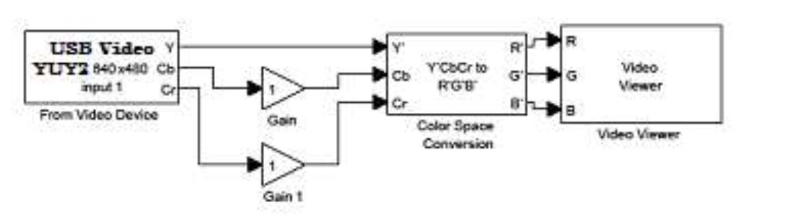
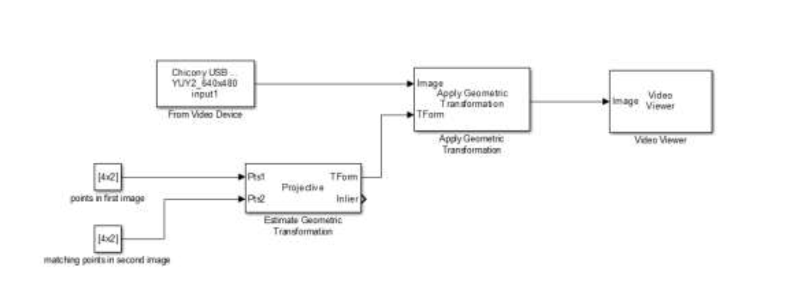
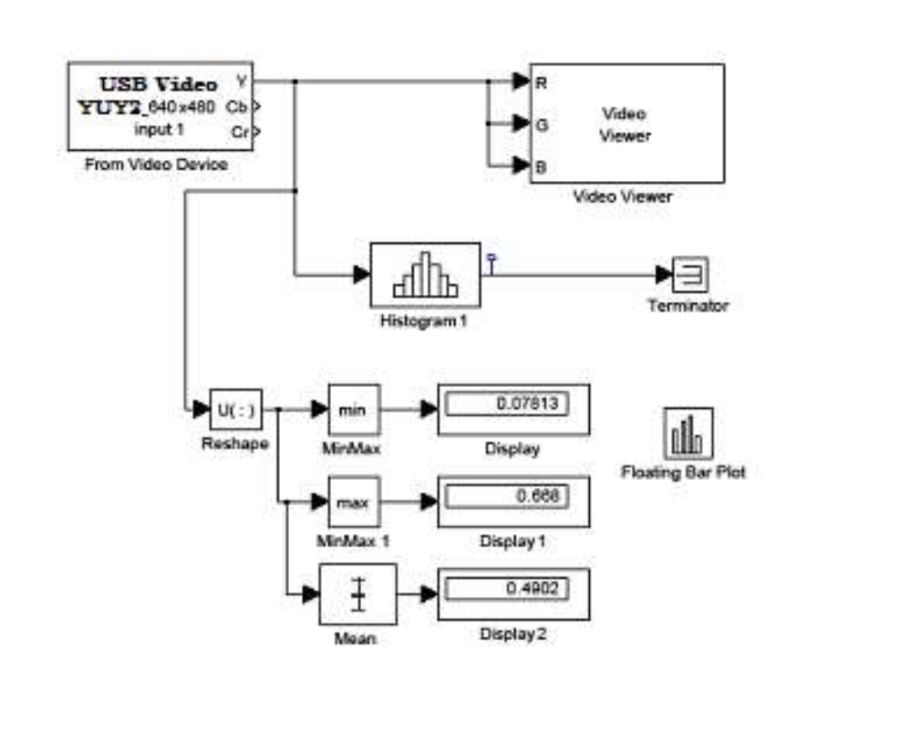
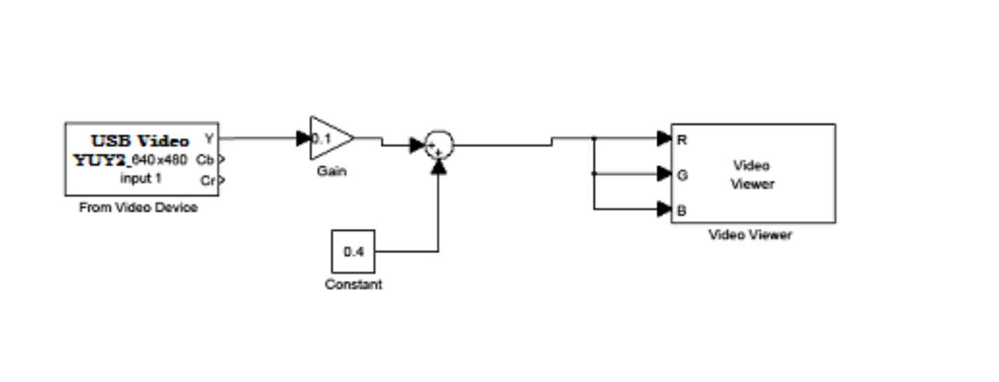

## Prerequisites

```shell(.line-numbers)
source env/bin/active
pip install -r requirements.txt
```

## usage

```shell
cd part1 && python display.py
cd part2 && python geomtrical_transformations.py
cd part3 && python histogram_display.py
```

## Objectives

- Introduction to fundamentals of colour image acquisition representation and display.
- Introduction to geometrical transformation.
- (Design, optional) and test a real-time histogram-equalisation algorithm.

## Introduction

Colour images are conventionally obtained by image sensors that can pick up red, green and blue wavelengths, recording three intensity values (called RGB). A colour image thus encodes RGB measurements for each pixel. However, it is more common to store and transmit images in an indirect form called YCrCb. The Y component represents an overall intensity while the Cr and Cb components encode the difference in intensity between different colour bands.
This laboratory also introduces the geometrical transformation capability using the Matlab Computer Vision Toolbox for rectifying image projection. A homography transformation is implemented and tested. Further, image histogram and histogram equalisation are also tested.

## Procedure

### Part 1: RGB image acquisition, colour conversion and display

#### 1.1 Set up the system below as a Simulink model.

The video input block can be found in the Image Acquisition toolbox (which supports most built-in or USB cameras) and the video viewer or display is from the Computer Vision System Toolbox (CVST). Set the video device to the default resolution of 1280 x 720 and YCrCb or RGB output (with separate colour signals). The display block should be set accordingly. Colour conversion block is also in CVST.
The default simulation time is 10 seconds –you should set this to something longer (say 100 seconds). Now run the model and confirm image display.

#### 1.2 Understanding the YCrCb and HSI representations

Set the video device to YCrCb and connect the blocks as shown below. Record the appearance of the image.

Instead of live camera, you can also choose to input a video (or an image) file form the Sources of CVST, e.g. the vipman.avi (or peppers.png) block, from which you can then click to choose the video (image) you wish to process and display either from CSVT data library or your own.

The Cr and Cb channels are harder to visualise since they contain both positive and negative values. Change the display block to YCrCb and connect the Cr and Cb outputs as shown below and adjust the scaling between 0.1 and 10 (use “Slidegain”). Record what you see.
Now use the “colour space conversion” block in CVST to generate HSV and repeat this procedure (i.e. observe the effect of scaling the H (hue) and S (saturation) channels).
Again record what you see. Discuss the practical meaning of Cr, Cb, H and S.

If time permits use a 2-D FIR filter from CVST to reduce the bandwidth in the Y channel. The coefficients should be a 3 by 3 constant matrix of value 1/9. This is entered as [1/9 1/9 1/9;1/9 1/9 1/9;1/9 1/9 1/9], replacing default [1 0; 0 1]. Record what you see. The human vision system is understood to have a lower resolution in colour than intensity. Repeat the experiment for the Cr/Cb and H/S channels with no filter in the Y channel. Comment on the effect.

### Part 2: Implementing Geometrical transformations

Use the model below to “rectify” a perspective view of the supplied rectangular object using a homography transform. You will need to decide dimensions of the output image and give corner coordinates (e.g. 500x500. See your course notes for an example). Then you should locate corresponding points in the perspective (input) image. Both sets of corner coordinates are specified in constant blocks (1st is that of the original image and 2nd is that of projected output image). The “Estimate Geometric Transform” block requires at least four corresponding points to be specified. To check the model works we can specify any four points in a constant block, for example use [0 0;100 0;100 100;0 100] initially for both constant boxes, as the inputs of “Estimate Geometrical Transformation”. Now run the model and confirm image display. Note, “Apply Geometric Transformation” should be set to Warp, “Estimate Geometric Transformation” should be set to Projective.

If you work from home or practise this before coming to the lab, change the input camera to image and use “myBoard.jpg”, the test image placed on BB. Then project it correctly so that the board text can be seen as upright. During the lab you will be given a board for your camera input. In-lab assessment will be based on rectifying the actual board.

Both sets of coordinates can be set initially to [0 0;100 0;100 100;0 100], this would introduce no change to the image. Then (using pixel inspection tool in the video viewer) find the (x, y) pixel coordinates of four corners (top-left, top-right, bottom-right, bottom-left) of the board in the input image and enter these coordinates to the 1st constant box. Then specify the coordinates for the projected image and enter them to the 2nd constant box, e.g. [0 0; 500 0; 500 500; 0 500], i.e. projecting to top-left corner of 500x500 pixels. Record what you have observed, esp. on inaccuracy and scale of the projection. What this can be used for?

### Part 3: Histogram display and histogram equalisation of intensity data

The image histogram is an important tool to understand image contrast and is the basis of the best- known image enhancement algorithm –histogram equalisation. As a starting point, set up the Simulink model below. You can use live camera feed or a video file (e.g. viplanedeparture.mp4).

The “2-D Histogram” block is in CVST (Statistics). The “Floating Bar Chart” can be found in “Simulink Extras” – you need to set the y limit to [0 20000] or similar, and the other blocks are in “Maths” and “Sinks”.

Right-click on the output from the histogram block and select “signal properties”. You need to click the “Test Point” option. Now run the model and click on the (blue) test point. You should see a histogram display for the image. Observe the histogram for different scene content. How consistent is this? Note or store an example image and corresponding histogram for your notes. There are various ways to do this but the simplest is to stop the model and use a Windows screen capture program (e.g. the “snipping tool”). Discuss the origin of the main features in the histogram with a demonstrator.

If your camera is not supported, change the input to the “vipman.avi” from CVST (Sources) and click it to load video “viplanedepature.mp4” and change the output to “Intensity”, then run the model.

Connect and explore the “Histogram Equalisation” block in CVST to the input and observe its effect on the input (a viewer for input video and a viewer for equalised out). For the best effect, pointing your camera to a dark or bright area of the room or use a low contrast video or add a “foggy” effect to the input as shown on next page before applying histogram equalisation.
(Optional) Now look away from the computer and design a histogram equalisation algorithm for implementation in Simulink using the blocks in the Simulink library.

Hint: there are two problems to solve:

1. Computing the required transformation by forming the cumulative sum of the bars of the histogram (as in the exercise discussed during the lectures but now automatically performed). You can find a cumulative sum (cumsum) block in the “Signal System Toolbox/Math Functions/Math Operators”.
2. Using the transformation to map input intensities to output intensities. There are various ways you could do this but one way is to use the dynamic LUT transformation that can be found in Simulink.

Go back to the computer and implement and test your algorithm. Assess effectiveness by producing a foggy image using the below

Insert your model before the viewer. The algorithm is expected to improve image clarity.
Test your algorithm in comparison with the packaged “histogram equalisation” block in the CVST. Show your system to a demonstrator.
You can “package” your block in the same way as the library version using the “subsystem” block. Test your version with different bin sizes (say from 1,5,10,20,50 and 100). Store some examples of processed images for your notes.
