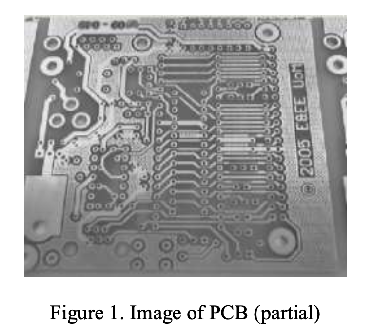
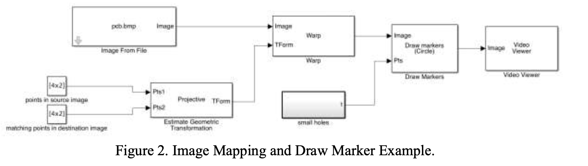
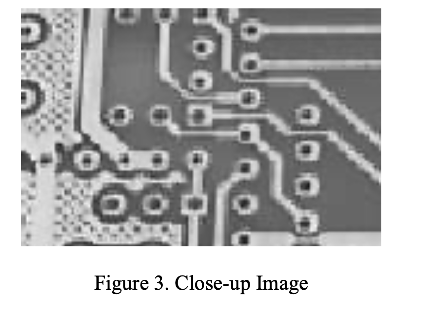

# EEEN4/60161 Digital Image Processing LABORATORY 2 (2023/24)

Objective: Meet an industrial inspection requirement.

## Introduction

An image processing system is required to detect the small holes in a printed circuit board (PCB) and to compare their position against a pre-defined specification. The primary aim of this experiment is to process the image so that an overlay of detected hole positions (say using red markers) can be shown plus an overlay of the pre-defined positions (say using green markers). A sample image (partial) is shown in Figure 1. It should be obvious by looking at the combined image if any holes are incorrect. A secondary objective (if time permits) will be to automatically produce a list of the coordinates of any small holes that are not present and the coordinates of any holes that fall more than 0.3 mm from the specified location. 

 

This laboratory exercise involves solving two problems. The first problem is to align the image with the coordinate system of the drill. A file containing the coordinates of the small drill holes is provided on Blackboard. The circuit boards are around 74 mm square and the coordinates are given in units of 0.1 mm. The registration should be visually confirmed using an image overlay.
The image must then be processed to identify the positions of the small drill holes. A second image overlay is then generated. All of the big holes should be ignored.
To meet the final objective (quantitative analysis) the coordinates of the drill holes must be converted into a list format and a procedure devised to find correspondences between the coordinates and the drill holes.

## Procedure

1. Setting up a template image analysis system

Set up the system shown in Figure 2 as a Simulink model with “From Video Device” as input (you would use a live camera pointing at the PCB when the experiment is performed in the lab). The “Image From File” (if you use a pre-saved image of the PCB board instead of a live camera), “Estimate Geometric Transform”, “Warp”, “Draw Markers” and “Video Viewer” blocks are from the Computer Vision System Toolbox (CVST), and the constant blocks are from the Sources. The “pcb.bmp” file (of 1280x720 resolution) and “small holes” model can be downloaded from Blackboard. Set the output data type of “Image From File” block to double.

The “Estimate Geometric Transform” block requires at least four corresponding points to be specified for projective transformation. For now, we can simply give any four points via a constant block: [0 0;100 0;100 100;0 100]. This should be the same for both inputs (later you can adjust the transform to match up the image with the drill coordinates).

Now run the model and confirm image display. 

 

This model will not solve the problem; the aim is simply to introduce the “Draw Marker” and the geometric transform blocks. The model “smallholes.mdl” contains a constant block called small holes that produces an output list of (x, y) coordinates for the hole positions. Remember that these coordinates refer to the PCB itself. When they appear in the actual image, they will be subjected to a perspective transformation.

2. Setting up the geometric transformation

The first step is to decide a resolution for the transformed image. As the circuit boards are 74 mm square and the drill hole coordinates are in units of 0.1 mm then an image resolution of 750 by 750 would allow easy comparison between pixel positions and actual displacements. For actual image processing you might find it better to generate a bigger image, say 1000 by 1000, using a scale of 0.075 mm/pixel. If you make it too big then image processing will be slow and the image will not fit on the screen. Too small and you will encounter problems with the sizing of structuring elements for morphological processing. These dimensions MUST be specified in the Apply Geometric Transform block (or sections will be missing from the output image).

The second step is to map a circuit board (pick a suitable one) to the pre-defined positions using the (projective) perspective transformation, and at least four landmark points (e.g. corner holes) must be found for the Estimate Geometric Transform block (1st set of points). There are lots of different (good) ways to do this.

3. Qualitative analysis

The first step is to devise an image processing procedure to detect the small PCB holes and place in between the “Warp” and “Draw Markers” blocks. There are many valid approaches to this task. You should inspect the image carefully and produce some notes describing your technical approach. Discuss your proposed solution with the laboratory staff before testing.

_Hints:_

The first step is generally to apply a thresholding operation to produce a binary image. There is an automatic threshold block available that uses Otsu’s method. However, this may not produce consistent results. An alternative is to set a constant threshold using a constant block and a “Relational Operator” (which can be found in the “commonly used blocks” section). The image shown in Figure 1 shows the effect of uneven illumination. It may be impossible to achieve sufficiently uniform illumination in actual inspection, so you might consider using image processing operations such as histogram equalisation and homomorphic filtering to mitigate this problem before or after thresholding.

Try to avoid detecting the dark patch at the centre of the holes as this is not a reliable feature. Instead concentrate on the bright ring that surrounds all the holes and detect this instead using appropriate morphological operators. A (poor-quality) sample close-up image is shown in Figure 3. It can be seen that the low resolution used here will make it difficult to achieve a reliable segmentation. It is a good idea to inspect the features you are using a zoom viewer in order to understand any problems that occur. 

 

Once it is working, a “Blob Analysis” block can be used to detect blob regions in the binary image automatically, and then you need to set up a second marker block so that your detected holes are overlaid onto the known positions (use a second marker block in series with the first and with a different colour). It should be possible then to compare the positions by eye and detect any problems.

4. Quantitative checking of hole positions

The final step (if time permits) is to automate the comparison of the detected and pre-defined hole locations. Produce a histogram of the positional errors. There are several erroneous holes in the defined locations to simulate detection of such errors.
Hint:
There is a “To Workspace” block that can be used to export coordinates to the workspace, then you write a Matlab function to calculate distances between the detected and pre-defined holes.

5. Evaluation

An evaluation of your system is required that addresses the following performance aspects: Reliability –does the system correctly identify all drill locations in the PCB? Does it identify extra unwanted positions?
Robustness –how sensitive is the system to changes in PCB position and lighting?
Accuracy –how accurate are the estimated drill locations?
